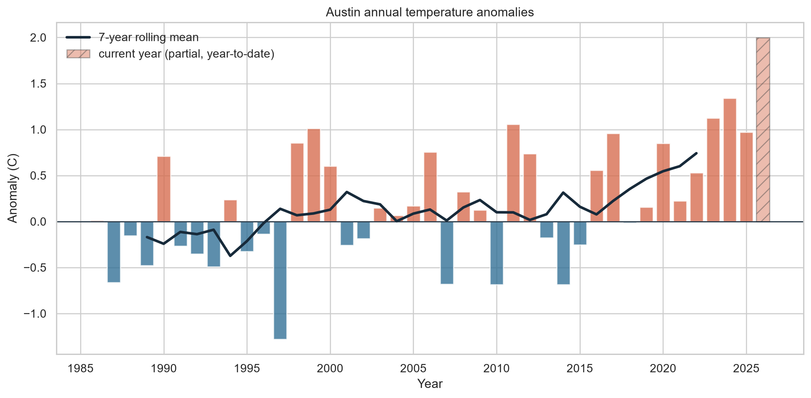
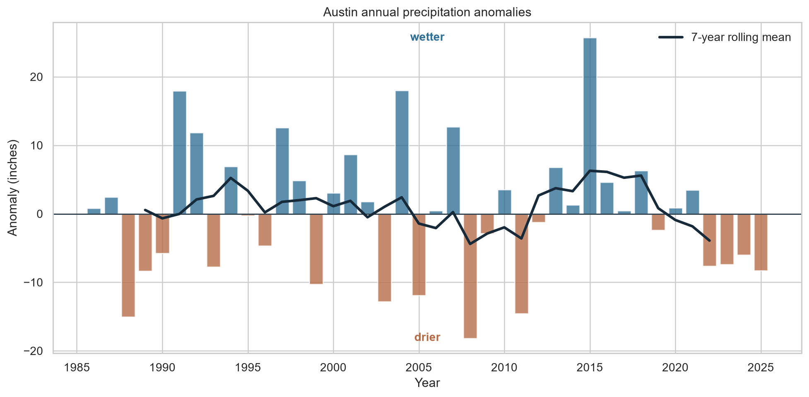
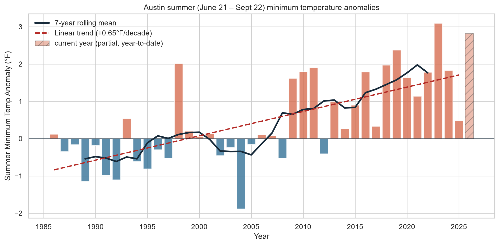
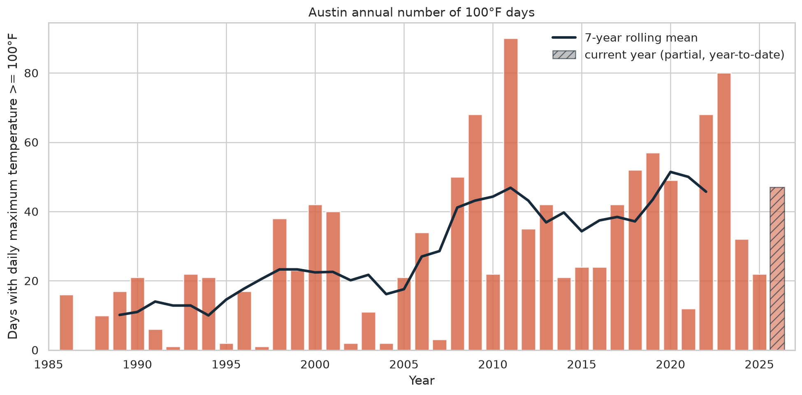
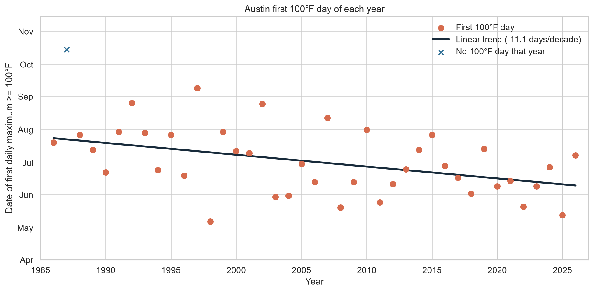

# Climate Trend Visualizer

A small, reproducible climate analysis project built around historical weather observations for Austin, Texas.

## Contents

- `data/historical_weather_austin_sample.csv`: Legacy sample dataset retained for reference only; not used as the active source in the current analysis.
- `data/austin_daily_weather.csv`: Daily Austin observations retrieved from Meteostat station 72254 and used as the project’s primary analysis dataset.
- `notebooks/climate_analysis.ipynb`: Narrative analysis with pandas, matplotlib, and seaborn.
- `outputs/temperature_anomalies.png`: Exported temperature anomaly chart.
- `outputs/precipitation_anomalies.png`: Exported Austin precipitation anomaly chart.
- `outputs/retrieve_austin_data.py`: Script used to retrieve and save daily Austin data.
- `outputs/tmin_anomalies.png`: Annual nighttime low temperature anomaly chart.
- `outputs/tmin_nh_summer_anomalies.png`: Astronomical summer nighttime low anomaly chart.
- `outputs/hot_days_per_year.png`: Annual count of days reaching at least 100°F.
- `outputs/first_hot_day_per_year.png`: Date of the first 100°F day in each year.
- `notebooks/austin_climate_exploration.ipynb`: Focused Austin climate exploration and trend analysis.

## Project status

The project currently provides a reproducible, notebook-based analysis of daily observations from Austin Camp Mabry station `72254`. It covers annual temperature, nighttime low temperature, summertime nighttime low temperature, precipitation, and the annual number of days reaching at least 100°F.

Known limitations:

- The analysis represents one station and should not be treated as a complete regional climate assessment.
- The current dataset ends at the latest retrieval date, and the 2026 record is incomplete.
- Missing daily observations and changing station conditions may affect annual summaries.
- The statistical results are descriptive and do not establish causation.
- The legacy sample CSV is retained for reference and is not used as the active source.

## Data provenance and retrieval

This project uses daily station observations from Meteostat for Austin Camp Mabry station `72254`.

- Data source: Meteostat daily weather API
- Station: Austin Camp Mabry (`72254`)
- Coverage: daily records from 1986-01-01 through the current date
- Retrieval script: `outputs/retrieve_austin_data.py`
- Latest data refresh: 2026-09-03
- Last reviewed: 2026-09-03
- Output file: `data/austin_daily_weather.csv`

The `data/historical_weather_austin_sample.csv` file is a legacy sample dataset kept for context and demonstration. It is not the authoritative or current source for the project. The active analysis uses the live daily Meteostat dataset in `data/austin_daily_weather.csv`, which is refreshed via `outputs/retrieve_austin_data.py`.

Use a trusted station dataset when producing research results, and treat the legacy sample as historical/reference material rather than a production climate record.

To refresh the daily Austin dataset, run `python outputs/retrieve_austin_data.py`. The script uses Meteostat station `72254` (Austin Camp Mabry) and retrieves records through the current date.

## Reproducing the analysis outputs

To regenerate the exported charts in `outputs/`:

1. Activate the project environment.
2. Install dependencies with `pip install -r requirements.txt`.
3. Run `python outputs/refresh_all.py`. It refreshes `data/austin_daily_weather.csv` first, then runs `notebooks/climate_analysis.ipynb` (without rewriting the notebook file), regenerates the 100°F-days and first-100°F-day charts, and copies the charts into `docs/assets/`.
4. Confirm that the PNG outputs in `outputs/` and `docs/assets/` update after execution.

The same pipeline runs automatically every day via the `Refresh data and charts` GitHub Actions workflow (`.github/workflows/refresh-data.yml`), which commits any updated data and charts. It can also be started manually from the Actions tab.

This workflow keeps the notebook, source data, and output charts aligned with each other.

## Analysis baseline and anomaly method

The project uses a fixed climatological baseline of 1985–2014 for its anomaly calculations. Each year’s value is compared against the average value over that baseline period.

- Annual temperature anomaly: yearly mean temperature minus the 1985–2014 mean temperature baseline.
- Annual nighttime low anomaly: yearly mean `tmin` minus the 1985–2014 mean `tmin` baseline.
- Summer nighttime low anomaly: summertime mean `tmin` over astronomical summer minus the 1985–2014 summer baseline.
- Precipitation anomaly: yearly precipitation total minus the 1985–2014 average precipitation baseline.

This makes the charts interpretable as departures from a consistent reference period rather than raw year-to-year changes alone.

The results in this project are descriptive and derived from a single weather station in Austin, Texas. They should be interpreted as a local station record rather than a full regional climate assessment.

## Quick statistical summary

Using the current daily Austin record, the annual weather summary is approximately:

- Mean annual temperature: 21.29°C
- Annual temperature variability (standard deviation): 0.86°C
- Long-term annual temperature trend: about +0.11°C per decade
- Mean annual nighttime low (`tmin`): 15.58°C
- Annual nighttime low variability: 0.62°C
- Long-term annual nighttime low trend: about +0.38°C per decade
- Mean annual precipitation: 859.9 mm
- Precipitation variability: 248.9 mm

These values are a lightweight descriptive summary of the station record and should be read alongside the anomaly charts and baseline notes above.

## 100°F days

The project also counts days when the daily maximum temperature (`tmax`) reaches at least 100°F (37.78°C). The chart covers 1986 through the present; the current, still-in-progress year is shown as a hatched "partial year" bar and is excluded from the rolling mean so it doesn't skew the trend. Run `python outputs/hot_days_per_year.py` to regenerate it.

## First 100°F day of the year

A companion chart plots the date of the first day each year with a daily maximum of at least 100°F, with a linear trend fitted over the years that reached 100°F (years that never did are marked separately and don't contribute a date). The current year is only treated as incomplete until its first 100°F day occurs; after that its date is final. Run `python outputs/first_hot_day_per_year.py` to regenerate it.

## Instagram export

`python outputs/instagram_export.py` writes a four-slide carousel to `outputs/social/`, each a 1080×1350 (4:5 portrait) PNG redrawn with large type for phones: days reaching 100°F, the first 100°F day of the year, nighttime-low anomalies, and annual temperature anomalies (in °F). It also writes `caption.txt` with a suggested caption whose numbers are computed from the current data. The export runs as the last step of `outputs/refresh_all.py`, so the daily workflow keeps the slides current; download them from `outputs/social/` on GitHub and post them as a carousel.

## Planned website stack

The planned climate landing page will use a static GitHub Pages site built with HTML, CSS, and vanilla JavaScript. The existing PNG charts can be reused directly, and a static site keeps hosting and maintenance simple while leaving room for responsive layout, unit toggles, and lightweight chart interactions later.

The first site version is in `docs/` and is ready for GitHub Pages deployment. Configure GitHub Pages to publish from the `main` branch and the `/docs` folder. To preview it locally, run `python -m http.server 8000 --directory docs` and open `http://localhost:8000/`.

The site includes a summary page, the annual temperature, nighttime-low, summer-nighttime-low, precipitation, and 100°F-days charts, responsive mobile styling, a Celsius/Fahrenheit trend control, and source, baseline, coverage, and limitation notes.

## Run the analysis

1. Create and activate a Python environment.
2. Install dependencies with `pip install -r requirements.txt`.
3. Open `notebooks/climate_analysis.ipynb` in VS Code or Jupyter.
4. Run all cells. The notebooks analyze annual and summer nighttime low temperature trends and export charts to `outputs/`.

## Sample outputs

### Annual temperature anomalies

### Precipitation anomalies

### Summer nighttime low anomalies

### Annual 100°F days

### First 100°F day of the year

The notebook and companion chart scripts currently produce four documented visual outputs: annual temperature anomalies, precipitation anomalies, annual nighttime low anomalies, and annual counts of 100°F days. The summer nighttime-low chart is also retained as a focused analysis output. Together, these outputs summarize long-term temperature departures, nighttime warming, precipitation variability, and extreme-heat frequency.
